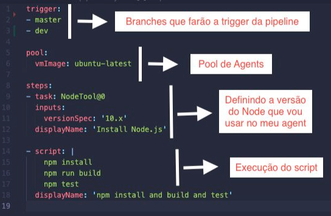

# Azure DevOps
Material de Estudo e indicações de atalhos para o dia-a-dia usando Azure DevOps
## Links úteis
**Informações úteis sobre Azure**
  https://azurecharts.com/timeline

## Azure DevOps - Pipelines

## O que é o Azure DevOps?

O Azure DevOps é a plataforma que a Azure criou para toda  aparte de automação de pipelines versionamento de código, versionamento de artefatos, controle de sprints. 
No Azure DevOps podemos ter total controle, administração e visualização dos times e da criação de estágios durante a criação de um produto.
**De forma geral o Azure DevOps**
```
https://docs.microsoft.com/pt-br/azure/devops/pipelines/?view=azure-devops
```
## Azure Pipelines

O Azure Pipelines é a maneira que você pode automatizar a execução dos seus scrips.

O Azure DevOps dentro do panorama de CI/CD nos permite criar integrações e automações para versionar nosso código, buildar nossa aplicação, assim como publicar e deployar os nosso serviços.

O Azure DevOps é escrito usando YAML. Temos diferentes maneira de criar nossas pipelines, mas uma sugestão é na estrutura abaixo e qual motivo para esta sugestão, facilidade na administração e facilidade em garantir que o padrão de escrita da pipeline ficará de fácil entendimento para todos que tiverem que dar manutenção na pipeline.

```
  |-- stages 
  |   └── jobs 
  |        └── steps
  |             └── tasks
  |-- stages 
  |   └── jobs 
  |        └── steps 
  |             └── tasks 
```
Este cenário acima na prática você pode encontrar no arquivo:
```
[Azure Pipelines](https://github.com/mnoskoski/azure-devops/blob/master/pipelines/pipelines-example02/.azure-pipelines/azure-pipelines.yml) 

```
**Stages**
```
https://docs.microsoft.com/pt-br/azure/devops/pipelines/process/stages?view=azure-devops&tabs=yaml
```

**Jobs**
```
https://docs.microsoft.com/en-us/azure/devops/pipelines/yaml-schema/jobs?view=azure-pipelines
```

**Steps**
```
https://docs.microsoft.com/en-us/azure/devops/pipelines/yaml-schema/steps?view=azure-pipelines
```

**Tasks**
```
https://docs.microsoft.com/en-us/azure/devops/pipelines/process/tasks?view=azure-devops&tabs=yaml 
```

```
**Pipeline Azure - Estrutura**
```
  https://docs.microsoft.com/pt-br/azure/devops/pipelines/get-started/pipelines-get-started?view=azure-devops
```
**Variáveis Azure**
```
https://docs.microsoft.com/pt-br/azure/devops/pipelines/process/variables?view=azure-devops&tabs=yaml%2Cbatch
```
**Variáveis de Pipeline Azure**
```
https://docs.microsoft.com/pt-br/azure/devops/pipelines/build/variables?view=azure-devops&tabs=yaml
```
**Azure Pipelines - Exemplos**


